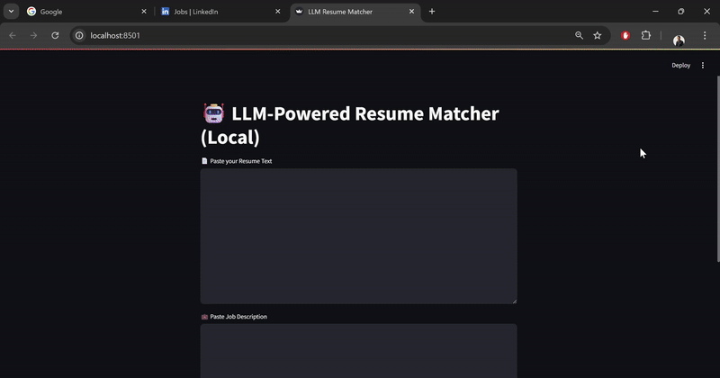

# 🤖 LLM Resume Matcher (Local with LM Studio)

A local, private, and offline Resume Matcher using LLMs via LM Studio. Calculates match scores between resumes and job descriptions, and provides recruiter-style feedback.

## 🔍 Features
- Cosine similarity with local embedding models (e.g. BGE)
- Feedback using local chat models (e.g. Mistral 7B)
- Streamlit UI
- 100% local, no OpenAI API required

## 📸 Demo




## ⚙️ Setup
```bash
git clone https://github.com/sid7shetty/llm-resume-matcher-lmstudio.git
cd llm-resume-matcher-lmstudio
pip install -r requirements.txt
streamlit run app.py
